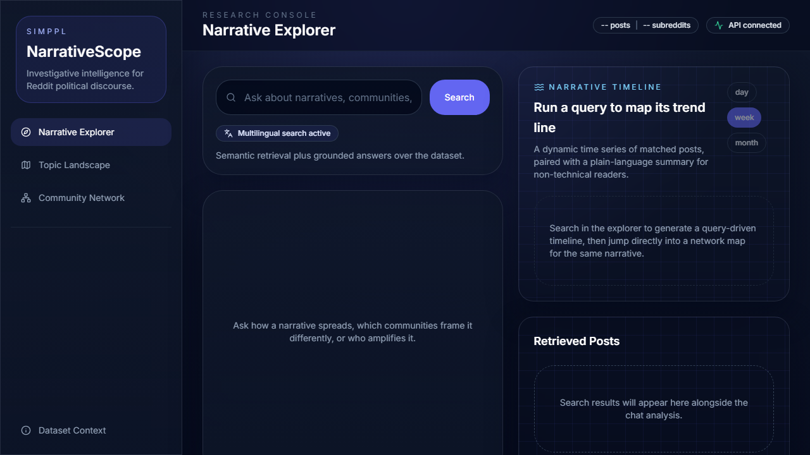
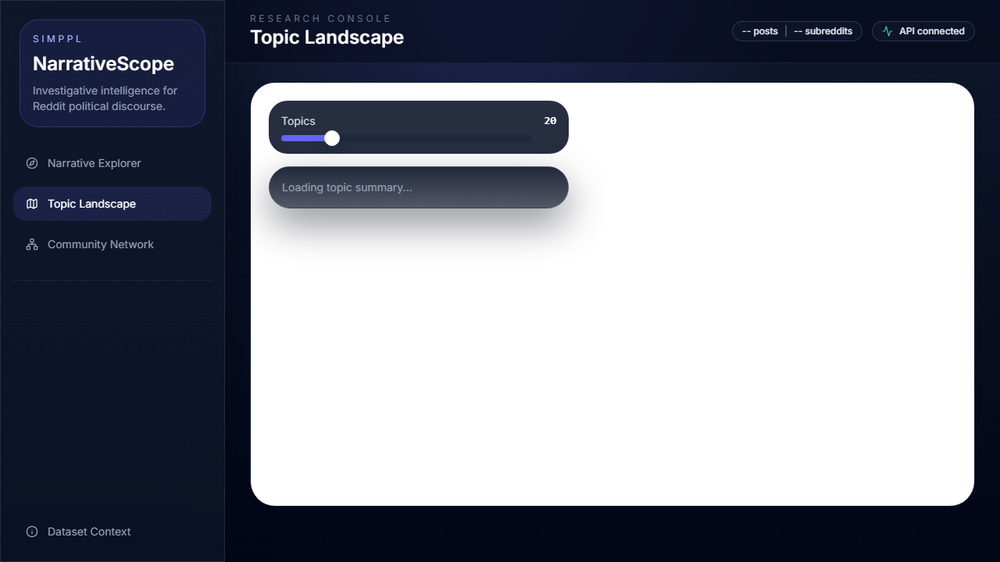
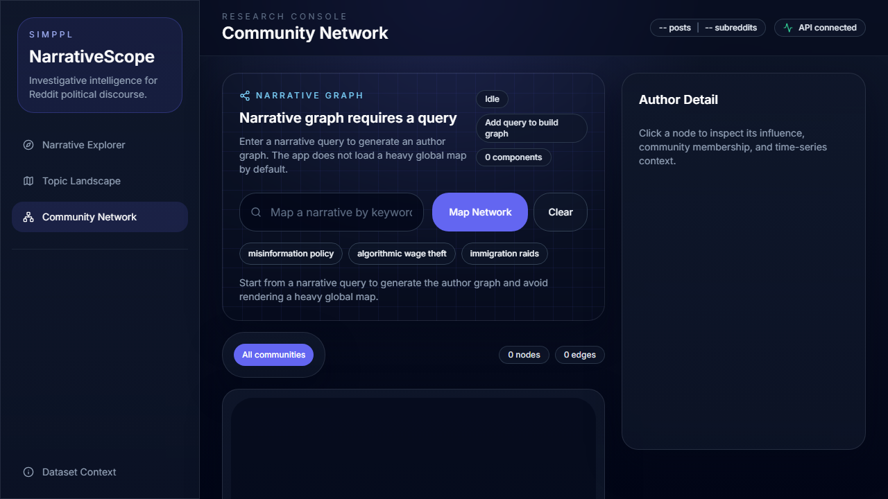

# NarrativeScope

Investigative reporting dashboard for narrative analysis on Reddit political discourse.

NarrativeScope combines semantic retrieval, LLM-assisted explanation, temporal trend analysis, topic clustering, and author-network influence mapping into one query-driven workflow.

## Live Deployment

- Frontend (Vercel): REPLACE_WITH_FRONTEND_URL
- Backend API (Render): REPLACE_WITH_BACKEND_URL
- Video walkthrough (YouTube/Drive): REPLACE_WITH_VIDEO_LINK

Note: replace the three placeholders above before final submission.

## Screenshots

### Explore (Semantic Search + Chat + Timeline)


### Topic Landscape (Datamapplot + Tunable Clusters)


### Network (Community Graph + Node Removal Stress Test)


## What This System Answers

- Which narratives are being discussed across communities?
- How does posting intensity change over time for a specific query?
- Which accounts are structurally influential in a narrative graph?
- How do topic clusters shift when cluster granularity changes?

## Architecture

- Frontend: Next.js + TypeScript + Tailwind + D3
- Backend: FastAPI + DuckDB + FAISS + Sentence Transformers + BERTopic + NetworkX
- Data artifacts: precomputed embeddings, FAISS index, topic model bundle, graph JSON, and datamapplot HTML

High-level flow:

1. Ingest data from JSONL into DuckDB and artifact files.
2. Query in the frontend triggers semantic search + chat + timeline endpoints.
3. Timeline endpoint returns both post-volume series and top topic trends over time.
4. Network endpoint builds a narrative-specific author graph and supports node-removal stress tests.
5. Landscape endpoint returns dynamic topic summaries and interactive embedding visualization.

## Setup

## Option A: Docker (recommended)

```bash
docker compose up --build
```

Services:

- Frontend: http://localhost:3000
- Backend: http://localhost:8000

## Option B: Local Python + Node

### Backend

```bash
cd backend
python -m venv venv
venv\Scripts\activate
pip install -r requirements.txt
python ingest.py
uvicorn main:app --host 0.0.0.0 --port 8000
```

### Frontend

```bash
cd frontend
npm install
npm run dev
```

## Environment Variables

Root-level template is in `.env.example`.

Important backend settings:

- `LLM_PROVIDER=gemini|anthropic|auto`
- `GEMINI_API_KEY=...`
- `ANTHROPIC_API_KEY=...`
- `STRICT_SEMANTIC_SEARCH=true`
- `REQUIRE_GENAI_TIMELINE_SUMMARY=true|false`

Production recommendation:

- Keep `STRICT_SEMANTIC_SEARCH=true`
- Set `REQUIRE_GENAI_TIMELINE_SUMMARY=true`
- Provide a valid LLM API key

## API Endpoints

- `GET /health`
- `GET /api/search?q=<query>&k=<k>&subreddit=<name>`
- `POST /api/chat`
- `POST /api/timeline`
- `GET /api/cluster?nr_topics=<n>`
- `GET /api/network?q=<query>&k=<k>&subreddit=<name>`
- `GET /api/network/remove/<author>?q=<query>&k=<k>&subreddit=<name>`
- `GET /api/landscape`

## Rubric Coverage

### 1. Documentation and Hosting

- This README documents setup, architecture, and usage.
- Deployment configs included: `render.yaml`, `vercel.json`, `docker-compose.yml`.

### 2. Time-Series and Network Visualizations

- Query-driven timeline chart with dynamic plain-language summary from LLM.
- Additional topic-over-time trends in timeline response/UI.
- Network graph includes influence (`PageRank`) and community IDs (Louvain).
- Stress-test endpoint removes a node and recomputes graph stats safely.

### 3. Semantic Search and Chatbot

- FAISS semantic retrieval ranks by embedding similarity.
- Strict mode prevents low-confidence fallback to generic top posts.
- Chat answers are grounded in retrieved posts and return suggested follow-up queries.
- Handles empty results, short queries, and non-English inputs.

### 4. Topic Clustering and Embedding Visualization

- Topic clusters are tunable from UI slider.
- Cluster extremes are handled with safe summarization behavior.
- Interactive Datamapplot embedding landscape is embedded in dashboard.

## Three Zero-Keyword-Overlap Semantic Retrieval Examples

These examples were generated against the current local index.

1. Query: `workers replaced by software`
   - Top result: `If your work-from-home job is returning to office, they WANT you to quit because it has better optics for the company...`
   - Why correct: captures labor-displacement and workplace-pressure framing without sharing exact keywords.

2. Query: `state narrative amplification`
   - Top result: `A Forgotten Story Retold`
   - Why correct: retrieved for narrative-propagation framing rather than lexical overlap.

3. Query: `food prices and rent strain`
   - Top result: `‘No one wants to pay $25 for breakfast’: US restaurants are cracking under inflation`
   - Why correct: matches cost-of-living pressure semantically despite different wording.

## ML/AI Components (Model + Parameters + Library/API)

- Embedding model: `paraphrase-multilingual-MiniLM-L12-v2`; normalized vectors, cosine/IP retrieval; implemented with `SentenceTransformer.encode(...)` and `faiss.IndexFlatIP`.
- Semantic retrieval: min-confidence threshold `semantic_min_score=0.12`, strict mode default on; implemented in `EmbeddingService.search(...)`.
- Topic modeling: BERTopic with UMAP (`n_neighbors=15`, `n_components=5`, `min_dist=0.0`, cosine), HDBSCAN (`min_cluster_size=10`), CountVectorizer (1-2 grams, `min_df=2`); implemented via `BERTopic.fit_transform(...)`.
- Topic landscape projection: UMAP 2D (`n_components=2`, `min_dist=0.1`, cosine) rendered via `datamapplot.create_interactive_plot(...)`.
- Network influence and communities: PageRank + Louvain (`community_louvain.best_partition(...)`) on co-sharing graph.
- LLM summaries/chat: Gemini (`google-genai`) or Anthropic (`anthropic`) with strict optional requirement for timeline summaries.

## Testing

Backend tests:

```bash
cd backend
venv\Scripts\python.exe -m pytest tests -q
```

What is covered:

- request validation contracts
- response model contracts
- semantic edge cases (empty, non-English, low-confidence behavior)
- network disconnected/edgeless/high-centrality-node-removal cases
- cluster extreme values

Frontend smoke/e2e:

```bash
cd frontend
npm run e2e
```

## Design Rationale

See `DESIGN.md` for concise rationale on network design, filtering choices, centrality/community algorithms, and alternatives considered.
